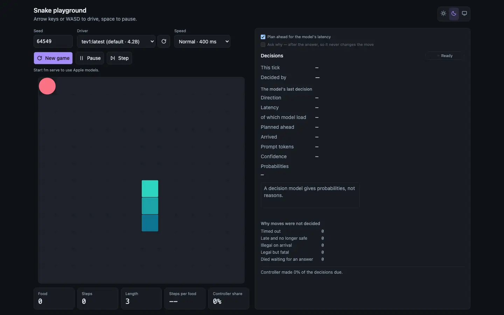
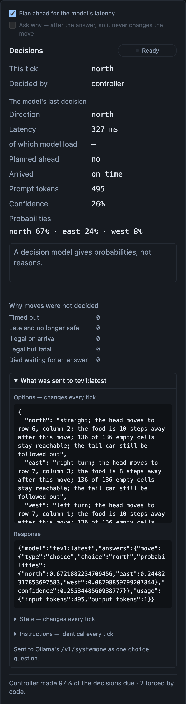

# local-llm-snake

A browser playground for watching local language models play Snake in real
time — and for measuring which ones can.

Each tick, a model is shown the board and exact facts about every safe move,
computed by code: where the head lands, how far the food is afterwards, how
much room stays reachable, and whether the move is a dead end. It picks one.

The yardstick is **JEV**, a hosted model built for exactly this kind of
choice: it is sent a state and a set of described options through its
SystemOne API, picks one, and is claimed to answer in under 200 ms. This
project cannot call JEV yet, for want of API access. The facts each model
receives here are the same inputs JEV receives in its
[reference implementation](https://github.com/sorrycc/typesafe-snake), so local
models and JEV can be compared on equal information
([ADR-0012](docs/adr/0012-single-prompt-matching-jev.md)).

Ollama's *decision* models (Ollama 0.35 and later, such as `tev1`, `nimble`,
and Cloudflare's `clef` and `clef-flash` from 0.35.1)
are asked the same way JEV is: they are sent the board and the options, choose
one, and return a probability for each
([ADR-0014](docs/adr/0014-decision-models-via-systemone.md)).

You can also drive the snake yourself with the keyboard.

<picture>
  <source media="(prefers-color-scheme: light)" srcset="docs/images/playing-light.webp">
  
</picture>

*tev1, a 4B decision model, playing at Normal speed (400 ms a tick).*

## Requirements

- **Node 22.18 or newer**, the first Node 22 release that runs TypeScript files
  without a flag; the tests and scripts rely on it. Developed on Node 24.
- **[Ollama](https://ollama.com)**, running, with at least one model pulled. The default is `tev1:latest`, a decision model, which needs Ollama
  0.35 or newer; any chat model works as well.
- *Optional:* **Apple Foundation Models** via the `fm` CLI on macOS, for
  Apple's on-device model.

## Getting started

```sh
npm install
npm run dev
```

Open <http://localhost:5173>.

Ollama is found automatically at `localhost:11434`, and every model it has is
listed in the **Driver** dropdown. To use Apple's model as well, start its
server in another terminal:

```sh
fm serve
```

It has to be started by hand; the dropdown notes when it is missing.

## Playing

- **Arrow keys** or **WASD** to steer, **space** to pause.
- **Driver** picks who plays: you, or any discovered model. Models carry
  labels such as *slow* or *avoid*, and once a model has played, its measured
  latency. Nothing is ever blocked — watching an unsuitable model fail is part
  of the point.
- **Speed** sets the tick, from Slow (1000 ms) to Turbo (60 ms). A model only
  keeps up if it answers within about a tick.
- **Plan ahead for the model's latency** sends a slow model the board as it
  will be when its answer lands, rather than as it is now
  ([ADR-0013](docs/adr/0013-latency-compensation-by-projection.md)).
- **Ask why** has the model explain each move. The explanation comes after the
  answer, so it never changes the move; it only adds latency. Decision models
  give probabilities instead, and ignore it.

The decision panel shows each tick, the model's last decision, how far ahead it
was planned and whether it arrived on time, why moves went undecided, and —
under *What was sent* — the exact prompt and response.



*The panel for one of tev1's moves: its probability for each option, the
options exactly as they were sent, and its raw answer.*

## What we have found

Measured on one Apple-silicon Mac; details in
[docs/findings.md](docs/findings.md).

- **Large chat models read the facts; small ones mostly do not.** gemma4:31b,
  qwen3.8:27b and muse-glimmer:30b chose well almost every time and rarely
  died. Smaller models picked by list position or close to at random, and
  starved.
- **The chat models that read the facts are too slow for real time.** At 1.1–1.3 s
  a move they get a decision only every other tick at Slow speed, and die
  waiting for the next one. Planning ahead helps a lot at Slow, but cannot make
  decisions more frequent.
- **tev1, a 4B decision model, is both fast and able to use the facts.** It
  survived every game without a clock, never walking into a dead end, and at
  about 310 ms a move it plays Normal speed in real time: all three games
  measured survived to the cap. It is still too slow for Fast.
- **Larger decision models are not better here.** Cloudflare's Clef Flash (9B)
  and Clef (27B) read the facts but survived fewer games than tev1 without a
  clock (1 and 3 of 5), at about 540 ms and 1.8 s a move.
- **A mixture-of-experts chat model comes close.** A Gemma 4 26B-A4B build,
  which runs about 4B of its 26B parameters per token, judged as well as the
  large models at about 550 ms a move. It survived every game at Slow speed,
  but at Normal it falls behind like the others.

## Scripts

| | |
|---|---|
| `npm run dev` | Dev server with hot reload |
| `npm run build` | Production build into `dist/` |
| `npm test` | All unit tests (`node:test`) |
| `npm run typecheck` | `vue-tsc` over the app and tests |
| `npm run lint` | `oxlint` |
| `npm run fmt:check` / `fmt` | Check or apply Prettier |
| `npm run shoot` | Headless screenshots at several viewport sizes, into `screenshots/`. Needs `npx playwright install chromium` once, and a running dev server |
| `npm run ai-smoke` | Plays a few ticks against Ollama to check the whole stack end to end |

Two measurement scripts need a running model and can take many minutes:

```sh
# Judgement: plays each model on seeded games with no clock, and reports how
# often it acts on the facts it is handed. `code` is a reference that picks the
# obvious move from the same facts, and `fm` is Apple's model via fm serve.
node scripts/eval-prompt.ts <models, comma-separated> [seeds] [maxTicks] [why]

# Real time: drives the actual game loop on a real clock, with planning ahead
# off and then on.
node scripts/realtime.ts <model> [slow|normal|fast|turbo] [seeds] [maxTicks]
```

The judgement script is repeatable: at temperature 0 a model makes the same
moves on the same seeds, so results can be compared across runs. Real-time
results are not, since they depend on how long each answer happens to take.

## Layout

| | |
|---|---|
| `src/game/` | The engine, the game loop and the move analysis. Pure TypeScript with no imports from outside itself, so it is tested without a browser |
| `src/ai/` | Model providers (Ollama, and the OpenAI-compatible API `fm serve` speaks), prompt assembly, and the controllers for chat and decision models |
| `src/prompts/jev-parity.json` | The chat prompt, schema and direction names, editable without touching code |
| `src/prompts/jev-decision.json` | The instructions and legend sent to decision models |
| `src/config/providers.json` | Providers, the default model and the rules behind each model's label |
| `src/ui/` | The Vue app |
| `tests/` | `node:test` suites |
| `scripts/` | Screenshots and measurement |
| `docs/` | Decisions, measurements and terms |

## Documentation

- [`docs/adr/`](docs/adr/README.md) — architecture decisions, with the
  alternatives that were weighed and rejected.
- [`docs/findings.md`](docs/findings.md) — the measurements those decisions
  rest on.
- [`docs/glossary.md`](docs/glossary.md) — terms such as *projection*,
  *planned tick* and *controller share*.
- [`docs/open-threads.md`](docs/open-threads.md) — what is still to build or
  decide.

## For contributors

Start with [AGENTS.md](AGENTS.md), written for coding agents and people alike.
The essentials:

- **Node runs TypeScript by stripping types**, so syntax that emits code —
  `enum`, `namespace`, parameter properties — fails at load. Use `as const`
  objects and ordinary fields.
- **Keep `src/game/` free of imports from the rest of the app**, so its tests
  need no DOM and no network.
- **Apple's `fm serve` is reached through a dev-server proxy** at `/fm`. It
  rejects any cross-origin browser request, so the browser cannot call it
  directly ([ADR-0007](docs/adr/0007-provider-abstraction.md)).

## License

[MIT](LICENSE).
